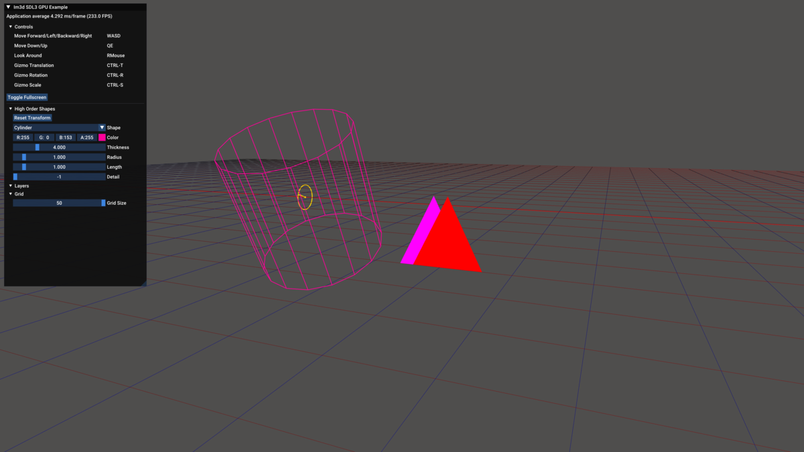

# IM3D SDL3 GPU EXAMPLE

This repository contains an example SDL3 GPU back-end for [im3d](https://github.com/john-chapman/im3d) and a demo app demonstrating it's usage.




If you just want to use this back-end you can grab the following files from the `src` folder and compile them with your application.
- `im3d_sdl3_gpu.h`
- `im3d_sdl3_gpu_shaders.h`
- `im3d_sdl3_gpu.cpp`

## Build

### Windows

Building the code can be done in a terminal which is equipped with the ability to call MSVC command line.

This is generally done by calling `vcvarsall.bat x64`, which is included in the Microsoft C/C++ Build Tools. This script is automatically called by the `x64 Native Tools Command Prompt for VS <year>` variant of the vanilla `cmd.exe`. If you've installed the build tools, this command prompt may be easily located by searching for `Native` from the Windows Start Menu search. The same script is also called automatically in the `Developer Command Prompt for VS <year>` profile of the terminal app.

You can ensure that the MSVC compiler is accessible from your command line by running:

```
cl
```

If everything is set up correctly, you should have output very similar to the following:

```
Microsoft (R) C/C++ Optimizing Compiler Version 19.44.35216 for x64
Copyright (C) Microsoft Corporation.  All rights reserved.

usage: cl [ option... ] filename... [ /link linkoption... ]
```

Now just run `build.bat` script.


```
build release
```


You should see the following output:

```
[release mode]
Compiling example...
main.cpp
util.cpp
im3d_sdl3_gpu.cpp
im3d.cpp
imgui.cpp
imgui_demo.cpp
imgui_draw.cpp
imgui_impl_sdl3.cpp
imgui_impl_sdlgpu3.cpp
imgui_tables.cpp
imgui_widgets.cpp
Generating Code...
Done!
```


If everything worked correctly, there will be a `build_release` folder in the root level of the project, and it will contain a freshly-built `im3d_sdl3_gpu_example.exe`.

This `im3d_sdl3_gpu_example.exe` has been built in release mode. If you'd like to modify the source and debug it, you can just run `build.bat` with no arguments for a debug build. The executable will be in a `build_debug` folder.

### Linux

Building the code can be done in a terminal. The build script will automatically download and build SDL3.

Because we have to first build SDL3 on Linux, please ensure you install it's dependencies by following the instructions for your Linux distribution here: https://github.com/libsdl-org/SDL/blob/main/docs/README-linux.md

Now just run the `build_linux.sh` script.

```
./build_linux.sh release
```


On the first run SDL3 will be downloaded and compiled to `extern/SDL3/linux`. Once that has completed you should see the following output:

```
[release mode]
Compiling example...
Done!
```


If everything worked correctly, there will be a `build_release` folder in the root level of the project, and it will contain a freshly-built `im3d_sdl3_gpu_example` executable.

This `im3d_sdl3_gpu_example` has been built in release mode. If you'd like to modify the source and debug it, you can just run `build_linux.sh` with no arguments for a debug build. The executable will be in a `build_debug` folder.

### Shader

The im3d shader is pre-compiled and the binary code is embedded in `im3d_sdl3_gpu_shaders.h`. If you'd like to modify the shader, you can run `build shaders` to compile the shader to all supported formats and export the data to the `im3d_sdl3_gpu_shaders.h` file.

## TODO

- [ ] Implement text drawing in the backend using some code from my [msdf text rendering example](https://github.com/adelciotto/sdl3_gpu_msdf_text).

## Dependencies / Tools

* [HandmadeMath](https://github.com/HandmadeMath/HandmadeMath)
* [SDL3](https://wiki.libsdl.org/SDL3/FrontPage)
* [im3d](https://github.com/john-chapman/im3d)
* [ImGui](https://github.com/ocornut/imgui)
* [SDL_shadercross](https://github.com/libsdl-org/SDL_shadercross) for compiling shaders.
